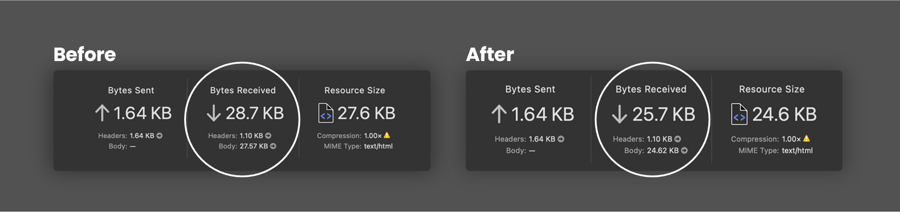

# Minify for Laravel

Minify for Laravel is a package for minifying and obfuscating Javascript, CSS, HTML and Blade views. It runs automatically when you load a page or view. Increase your website performance on page load and save bandwidth. Obfuscate your Javascript to protect your code from being stolen.

<p align="left">
<a href="https://packagist.org/packages/fahlisaputra/laravel-minify"></a>
<a href="https://packagist.org/packages/fahlisaputra/laravel-minify"></a>
<a href="https://packagist.org/packages/fahlisaputra/laravel-minify"></a>
<a href="https://github.styleci.io/repos/667860309?branch=main"></a>
</p>

## Comparison

This image shows the difference in size between the original file and the minified file of default welcome.blade.php Laravel. The original file size is 28.7 KB and the minified file size is 25.7 KB. The minified file size is 10% smaller than the original file size.



If you minify all your asset files, you can save up to 50% of your bandwidth. This will make your website load faster and save your hosting cost. When you have big files, the difference in size will be even greater.

## Installation

Minify for Laravel requires PHP 7.2 or higher. This particular version supports Laravel 8.x, 9.x, 10.x, and 11.x.

To get the latest version, simply require the project using [Composer](https://getcomposer.org):

```sh
composer require fahlisaputra/laravel-minify
```
## Configuration
Minify for Laravel supports optional configuration. To get started, you'll need to publish all vendor assets:

```sh
php artisan vendor:publish --provider="Fahlisaputra\Minify\MinifyServiceProvider"
```

This will create a config/minify.php file in your app that you can modify to set your configuration. Also, make sure you check for changes to the original config file in this package between releases.

## Register the Middleware (Laravel 11 or newer)
In order Minify for Laravel can intercept your request to minify and obfuscate, you need to add the Minify middleware to the `bootstrap/app.php` file:

```php
->withMiddleware(function (Middleware $middleware) {
    $middleware->web(append: [
        \Fahlisaputra\Minify\Middleware\MinifyHtml::class,
        \Fahlisaputra\Minify\Middleware\MinifyCss::class,
        \Fahlisaputra\Minify\Middleware\MinifyJavascript::class,
    ]);
})
```

## Register the Middleware (Laravel 10 or older)
In order Minify for Laravel can intercept your request to minify and obfuscate, you need to add the Minify middleware to the `app/Http/Kernel.php` file:

```php
protected $middleware = [
    ....
    // Middleware to minify CSS
    \Fahlisaputra\Minify\Middleware\MinifyCss::class,
    // Middleware to minify Javascript
    \Fahlisaputra\Minify\Middleware\MinifyJavascript::class,
    // Middleware to minify Blade
    \Fahlisaputra\Minify\Middleware\MinifyHtml::class,
];
```
You can choose which middleware you want to use. Put all of them if you want to minify html, css, and javascript at the same time.

## Usage

This is how you can use Minify for Laravel in your project.

### Minify Asset Files
You must set `true` on `assets_enabled` in the `config/minify.php` file to minify your asset files. 
If the option set to `false` the route will not registered from service provider. For example:

```php
"assets_enabled" => env("MINIFY_ASSETS_ENABLED", true),
```

You can minify your asset files by using the `minify()` helper function. This function will minify your asset files and return the minify designed route. For example:

```html
<link rel="stylesheet" href="{{ minify('/css/test.css') }}">
```

```html
<script src="{{ minify('/js/test.js') }}"></script>
```

You can modify the assets storage directory path by setting `assets_path` in the `config/minify.php` file. By default, the assets storage directory path is `resources`. For example:

```php
"assets_storage" => env("MINIFY_ASSETS_STORAGE", 'resources'),
```

In order to minimize the security risk, the root storage directory is hidden from the public. For the example, you set the `assets_storage` to `storage/app/private/assets` and you want to access the file `test.css` in the `storage/app/private/assets/test.css`. You can use the `minify()` helper function like this:

```html
<link rel="stylesheet" href="{{ minify('test.css') }}">
```

The `minify()` helper function will automatically search the file in the `storage/app/private/assets` directory. The result on the browser will be like this:

```html
<link rel="stylesheet" href="{minify_route_path}/test.css">
```

The `/storage/app/private/assets` directory is hidden from the public.

### Automatic Insert Semicolon on Javascript or CSS
Use this option if Minify for Laravel makes your javascript or css not working properly. You can enable automatic insert semicolon on javascript or css by setting `true` on `insert_semicolon` in the `config/minify.php` file. For example:

```php
"insert_semicolon" => [
    'css' => env("MINIFY_CSS_SEMICOLON", true),
    'js' => env("MINIFY_JS_SEMICOLON", true),
],
```
Caution: this option is experimental. If the code still not working properly, you can disable this option and add semicolon manually to your Javascript or CSS code.

### Skip Minify on Blade
You can skip minify on blade by using attribute `ignore--minify` inside script or style tag. For example:

```html
<style ignore--minify>
    /* css */
</style>

<script ignore--minify>
   /* javascript */
</script>
```

### Skip Minify when Rendering View
You can skip minify when rendering view by passing `ignore_minify = true` in the view data. For example:

```php
return view('welcome', ['ignore_minify' => true]);
```

### Skip Minify by Route
You can skip minify by route by adding the route name to the `ignore` array in the `config/minify.php` file. For example:

```php
"ignore" => [
    '/admin'
],
```

### Custom Directives Replacement
You can replace custom directives by adding the directive name to the `directives` array in the `config/minify.php` file. For example in AlpineJS you can write `@click="function()"`. Unfortunately, Minify for Laravel will remove the `@` symbol. You can replace it by adding `@ => x-on:`  to the `directives` array. For example:

```php
"directives" => [
    '@' => 'x-on:',
],
```

### Keep Directives
You can keep directives by adding the directive name to the `keep_directives` array in the `config/minify.php` file. For example when you use `@vite`, you can add `@vite` to the `keep_directives` array. For example:

```php
"keep_directives" => [
    '@vite'
],
```

## Known Issues

- Minify for Laravel will remove the `@` symbol in the blade file. This will make the blade directive not working properly. You can fix this by adding `@ => x-on:` to the `directives` array in the `config/minify.php` file.
- Does not support for some Javascript framework. You can try experiment by changing the `insert_semicolon` option to `true` or `false` in the `config/minify.php` file.

## Contributing

If you find an issue, or have a better way to do something, feel free to open an issue, or a pull request. The package is far from perfect, and any help is welcome. There are no formal contribution guidelines, and there should be no contribution too small. All coding styles will be fixed during the pull request by StyleCI. So, don't worry too much about the code style. We'd love to hear from you!

## Thanks
Big thanks to the people who have contributed to this package:
- [@SaeedHeydari](https://github.com/SaeedHeydari)

## License
Laravel Minify is licensed under the [MIT license](LICENSE).

## Support
If you are having general issues with this package, feel free to contact us on [saputra@fahli.net](mailto:saputra@fahli.net)

## Report Vulnerability
Please read [our security policy](https://github.com/fahlisaputra/laravel-minify/security/policy) for more details.
